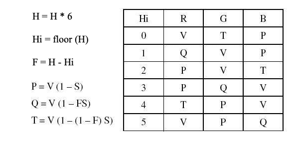

# CSE 455 Homework 0 #

Welcome. For the first assignment we'll just get to know the codebase a little bit and practice manipulating images! You'll be modifying the file `src/hw0/process_image.c`.

Everytime you make any changes to the code, run the commands:

    make clean
    make
 
Then you can quickly test your changes by running:

    ./main test hw0

If you run the above code without making any changes to the original repo, you will get the following result:
    
    17 tests, 3 passed, 14 failed

Once everything is implemented correctly, you will get:

    17 tests, 17 passed, 0 failed

You can also try running the example python code to generate some images:

    python tryhw0.py

### Image basics ###

We have a data structure to store images in our library. The `image` struct stores the image metadata like width (w), height (h), and number of channels (c). It also contains the image pixel values stored as a floating point array (data). The data values are between 0 and 1. You can check it out in `src/image.h`, it looks like this:

    typedef struct{
        int h,w,c;
        float *data;
    } image;

Note, an image is a 3D array, but we'll linearize it into a 1D array here (refer to the lecture slides). In short, we save the values along the 1st row, then the 2nd row and so on for the 1st channel, then do the same for the 2nd channel and so on. We have also provided some functions for loading and saving images in `load_image.c`. Use the function:

    image im = load_image("image.jpg");

to load a new image. To save an image use:

    save_image(im, "output");

which will save the image as `output.jpg`. If you want to make a new image with dimensions Width x Height x Channels you can call:

    image im = make_image(w,h,c);

You should also use: 

    free_image(im);

when you are done with an image, so it goes away. You can check out how all this is implemented in `src/load_image.c`. You probably shouldn't change anything in this file. We use the `stb_image` library for the actual loading and saving of jpgs.

## 1. Getting and setting pixels ##

The most basic operation we want to do is change the pixels in an image. As we talked about in class, we represent an image as a 3 dimensional tensor. We have spatial information as well as 3 channels (red, green and blue) which combine together to form a color image:

The convention is that the coordinate system starts at the top left of the image, like so:

In our `data` array we store the image in `CHW` format. The first pixel in data is at channel 0, row 0, column 0. The next pixel is channel 0, row 0, column 1, then channel 0, row 0, column 2, etc.

#### TO DO ####
Your first task is to fill out these two functions in `process_image.c`:

    float get_pixel(image im, int x, int y, int c);
    void set_pixel(image im, int x, int y, int c, float v);

`get_pixel` should return the pixel value at column `x`, row `y`, and channel `c`. `set_pixel` should set the pixel to the value `v`. You will need to do bounds checking to make sure the coordinates are valid for the image. `set_pixel` should simply return without doing anything if you pass in invalid coordinates. For `get_pixel` we will perform padding to the image. There are a number of possible padding strategies:

We will use the `clamp` padding strategy. This means that if the programmer asks for a pixel at column -3, use column 0, or if they ask for column 300 and the image is only 256x256 you will use column 255 (because of zero-based indexing).

We can test out our pixel-setting code on the dog image by removing all of the red channel. See line 3-8 in `tryhw0.py`:

    # 1. Getting and setting pixels
    im = load_image("data/dog.jpg")
    for row in range(im.h):
        for col in range(im.w):
            set_pixel(im, row, col, 0, 0)
    save_image(im, "figs/dog_no_red")

Then try running it. Check out our very not red dog:

## 2. Copying images ##

Sometimes you have an image and you want to copy it! To do this we should make a new image of the same size and then fill in the data array in the new image. You could do this by getting and setting pixels, by looping over the whole array and just copying the floats (pop quiz: if the image is 256x256x3, how many total pixels are there?), or by using the built-in memory copying function `memcpy`.

#### TO DO ####
Fill in the function `image copy_image(image im)` in `process_image.c` with your code.

## 3. Grayscale image ##

Now let's start messing with some images! We will first convert color images to grayscale. Here's a colorbar we may want to convert:

If we convert it using an equally weighted mean Y = (R+G+B)/3 we get a conversion that doesn't match our perceptions of the given colors:

Instead we are going to use a weighted sum. Now, there are a few ways to do this. Video engineers use a calculation called [luma][2] to find an approximation of perceptual intensity when encoding video signal, so we'll use that to convert our image to grayscale. We simply perform a weighted sum:

    Y = 0.299 R + 0.587 G + .114 B

Using this conversion technique, the colorbar becomes:

#### TO DO ####
Implement this conversion for the function `image rgb_to_grayscale(image im)`. Return a new image that is the same size but having only one channel containing the calculated luma values. Now we can run `tryhw0.py` to output `graybar.jpg`. See lines 10-13:

    # 3. Grayscale image
    im = load_image("data/colorbar.png")
    graybar = rgb_to_grayscale(im)
    save_image(graybar, "graybar")

## 4. Shifting the image colors ##

Now let's write a function to add a constant factor to a channel in an image. We can use this across every channel in the image to make the image brighter or darker. 

#### TO DO ####
Fill in the code for `void shift_image(image im, int c, float v)`. It should add `v` to every pixel in channel `c` in the image `im`. Now we can try shifting all the channels in an image by `.4` or 40%. See lines 15-20 in `tryhw0.py`:

    # 4. Shift Image
    im = load_image("data/dog.jpg")
    shift_image(im, 0, .4)
    shift_image(im, 1, .4)
    shift_image(im, 2, .4)
    save_image(im, "overflow")

But wait, when we look at the resulting image `overflow.jpg` we see something bad has happened! The light areas of the image went above 1 and when we saved the image back to disk it overflowed and made weird patterns:

## 5. Clamping the image values ##

We want to make sure the pixel values in the image stay between 0 and 1. Implement clamping on the image so that any value below 0 gets set to 0 and any value above 1 gets set to 1. 

#### TO DO ####
Fill in `void clamp_image(image im)` to modify the image in-place. Then when we clamp the shifted image and save it we see much better results, see lines 22-24 in `tryhw0.py`:

    # 5. Clamp Image
    clamp_image(im)
    save_image(im, "doglight_fixed")

and the resulting image, `doglight_fixed.jpg`:

## 6. RGB to Hue, Saturation, Value ##

So far we've been focussing on RGB and grayscale images. But there are other colorspaces out there too we may want to play around with. Like [Hue, Saturation, and Value (HSV)](https://en.wikipedia.org/wiki/HSL_and_HSV). We will be translating the cubical colorspace of sRGB to the cylinder of hue, saturation, and value:

[Hue](https://en.wikipedia.org/wiki/Hue) can be thought of as the base color of a pixel. [Saturation](https://en.wikipedia.org/wiki/Colorfulness#Saturation) is the intensity of the color compared to white (the least saturated color). The [Value](https://en.wikipedia.org/wiki/Lightness) is the perception of brightness of a pixel compared to black. You can try out this [demo](http://math.hws.edu/graphicsbook/demos/c2/rgb-hsv.html) to get a better feel for the differences between these two colorspaces. For a geometric interpretation of what this transformation:

The easiest component to calculate is the Value, it's just the largest of the 3 RGB components:

    V = max(R,G,B)

Next we calculate Saturation. This is a measure of how much color is in the pixel compared to neutral white/gray. Neutral colors have the same amount of each three color components, so to calculate saturation we see how far the color is from being even across each component. First we find the minimum value

    m = min(R,G,B)

Then we see how far apart the min and max are:

    C = V - m

and the Saturation will be the ratio between the difference and how large the max is:

    S = C / V

Except if R, G and B are all 0. Because then V would be 0 and we don't want to divide by that, so just set the saturation 0 in that case.

Finally, to calculate Hue we want to calculate how far around the color hexagon our target color is.

We start counting at Red. Each step to a point on the hexagon counts as 1 unit distance. The distance between points is given by the relative ratios of the secondary colors. We can use the following formula from [Wikipedia](https://en.wikipedia.org/wiki/HSL_and_HSV#Hue_and_chroma):

There is no "correct" Hue if C = 0 because all of the channels are equal so the color is a shade of gray, right in the center of the cylinder. However, we will just set H = 0 if C = 0.

Notice that we are going to have H = \[0,1) and it should circle around if it gets too large or goes negative. Thus we check to see if it is negative and add one if it is. This is slightly different than other methods where H is between 0 and 6 or 0 and 360. 

#### TO DO ####
Fill in `void rgb_to_hsv(image im)`. We will store the H, S, and V components in the same image, so simply replace the R channel with H, the G channel with S and the B channel with V.

## 7. HSV to RGB ##

Now we will do the reverse. The formulas to convert H, S and V to R, G and B respectively are given as:

#### TO DO ####
Fill in `void hsv_to_rgb(image im)` to change the input image in-place.

Finally, when your done we can mess with some images! In `tryhw0.py` we convert an image to HSV, increase the saturation, then convert it back, lines 26-32:

    # 6-7. Colorspace and saturation
    im = load_image("data/dog.jpg")
    rgb_to_hsv(im)
    shift_image(im, 1, .2)
    clamp_image(im)
    hsv_to_rgb(im)
    save_image(im, "dog_saturated")

That's exciting! You may play around with it a little bit to see what you can make. Note that with the above method we do get some artifacts because we are trying to increase the saturation in areas that have very little color. Instead of shifting the saturation, you could scale the saturation by some value to get smoother results!

## 8. Extra credit ##

Implement `void scale_image(image im, int c, float v)` to scale a channel by a certain amount. This will give us better saturation results. Note, you will have to add the necessary lines to the header file(s) to include the function, it should be very similar to what's already there for `shift_image`. Now if we multiply (scale) saturation by `2` instead of just shifting it all up we get much better results:

    im = load_image("data/dog.jpg")
    rgb_to_hsv(im)
    scale_image(im, 1, 2)
    clamp_image(im)
    hsv_to_rgb(im)
    save_image(im, "dog_scale_saturated")
    

## 9. Super extra credit ##

Implement RGB to [Hue, Chroma, Lightness](https://en.wikipedia.org/wiki/CIELUV#Cylindrical_representation_.28CIELCH.29), a perceptually more accurate version of Hue, Saturation, Value. Note, this will involve gamma decompression, converting to CIEXYZ, converting to CIELUV, converting to HCL, and the reverse transformations. The upside is a similar colorspace to HSV but with better perceptual properties!

## Turn it in ##

You only need to turn in one file, your `process_image.c`. Use the canvas link on the class website.

[1]: https://en.wikipedia.org/wiki/SRGB#The_sRGB_transfer_function_("gamma")
[2]: https://en.wikipedia.org/wiki/Luma_(video)
