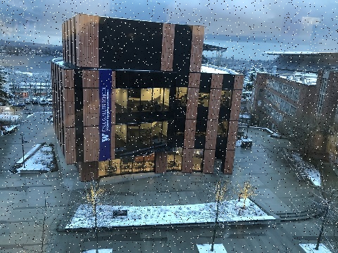
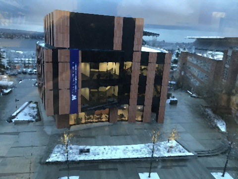

# CSE 455 Homework 2 #

This homework is 2x longer than the previous homework. So, start early!

If we want to perform the large shrinking operations that we talked about in the last homework we need to first smooth our image. We'll start out by filtering the image with a box filter. There are very fast ways of performing this operation but instead, we'll do the naive thing and implement it as a convolution because it will generalize to other filters as well!

First run the following:

```
git pull
make clean
make
```

Then run `./main test hw2`. For python tests use `python tryhw2.py`. 

### 2.0: Cut and Paste two functions from previous homework  ####

#### TO DO ####
Note that you wrote two functions (i.e. `l1_normalize` and `make_box_filter`) in  homework 1, which will be useful for this assignment. Simply **CUT** your solution from your previous submission to the `filter_image.c` file and paste in the current file to avoid getting compiler (linker) error similar to "multiple definition of `make_box_filter` (or `l1_normalize`)".

We did not grade these two functions for correctness in the previous homework, so make sure you submit these two functions again this time.

### 2.1 Write a convolution function ###

#### TO DO ####
Now it's time to fill in `image convolve_image(image im, image filter, int preserve)`. For this function we have a few scenarios. With normal convolutions we do a weighted sum over an area of the image. With multiple channels in the input image there are a few possible cases we want to handle:

- If `filter` and `im` have the same number of channels then it's just a normal convolution. We sum over spatial and channel dimensions and produce a 1 channel image. UNLESS:
- If `preserve` is set to 1 we should produce an image with the same number of channels as the input. This is useful if, for example, we want to run a box filter over an RGB image and get out an RGB image. This means each channel in the image will be filtered by the corresponding channel in the filter. UNLESS:
- If the `filter` only has one channel but `im` has multiple channels we want to apply the filter to each of those channels. Then we either sum between channels or not depending on if `preserve` is set.

Also, `filter` should have either the same number of channels as `im` or have 1 channel. This is checked with an `assert`.

For your information, we use "clamp" padding for the borders, which you can easily engineer with the "get_pixel" function in homework 0.

We are calling this a convolution but you don't need to flip the filter or anything (we're actually doing a cross-correlation). Just apply it to the image as we discussed in class:


Once you are done, test out your convolution by filtering our image! We need to use `preserve` because we want to produce an image that is still RGB.

    from uwimg import *
    im = load_image("data/dog.jpg")
    f = make_box_filter(7)
    blur = convolve_image(im, f, 1)
    save_image(blur, "dog-box7")

We'll get some output that looks like this:


Now we can use this to perform our thumbnail operation:

    im = load_image("data/dog.jpg")
    f = make_box_filter(7)
    blur = convolve_image(im, f, 1)
    thumb = nn_resize(blur, blur.w//7, blur.h//7)
    save_image(thumb, "dogthumb")


Look at how much better our new resized thumbnail is!

Resize                     |  Blur and Resize
:-------------------------:|:-------------------------:
    | 

### 2.2 Make some more filters and try them out! ###

#### TO DO ####
Fill in the functions `image make_highpass_filter()`, `image make_sharpen_filter()`, and `image make_emboss_filter()` to return the example kernels we covered in class. Try them out on some images! After you have, answer Question 2.2.1 and 2.2.2 in the source file (put your answer just right there)

Highpass                   |  Sharpen                  | Emboss
:-------------------------:|:-------------------------:|:--------------------|
     |      | 

### 2.3 Implement a Gaussian kernel ###

#### TO DO ####
Implement `image make_gaussian_filter(float sigma)` which will take a standard deviation value and return a filter that smooths using a Gaussian with that sigma. How big should the filter be? 99% of the probability mass for a Gaussian is within +/- 3 standard deviations so make the kernel be 6 times the size of sigma. But also we want an odd number, so make it be the next highest odd integer from 6x sigma. For instance, if sigma is 0.6, then the size of the Gaussian filter is 5 x 5; if sigma is 2, then the size of Gaussian filter is 13 x 13.

We need to fill in our kernel with some values. Use the probability density function for a 2D Gaussian:


Technically this isn't perfect, what we would really want to do is integrate over the area covered by each cell in the filter. But that's much more complicated and this is a decent estimate. Remember though, this is a blurring filter so we want all the weights to sum to 1. Now you should be able to try out your new blurring function:

    im = load_image("data/dog.jpg")
    f = make_gaussian_filter(2)
    blur = convolve_image(im, f, 1)
    save_image(blur, "dog-gauss2")

It should have much less noise than the box filter!


## 2.4 Hybrid images ##

Gaussian filters are cool because they are a true low-pass filter for the image. This means when we run them on an image we only get the low-frequency changes in an image like color. Conversely, we can subtract this low-frequency information from the original image to get the high frequency information!

Using this frequency separation we can do some pretty neat stuff. For example, check out [this tutorial on retouching skin](https://petapixel.com/2015/07/08/primer-using-frequency-separation-in-photoshop-for-skin-retouching/) in Photoshop (but only if you want to).

We can also make [really trippy images](http://cvcl.mit.edu/hybrid/OlivaTorralb_Hybrid_Siggraph06.pdf) that look different depending on if you are close or far away from them. That's what we'll be doing. They are hybrid images that take low frequency information from one image and high frequency info from another. Here's an example:

Small                     |  Medium | Large
:-------------------------:|:-------:|:------------------:
   |  | 

Check out `figs/marilyn-einstein.png` and view it from far away and up close. Your job is to produce a similar image. But instead of famous dead people we'll be using famous fictional people from the Harry Potter franchise! Like this:

Small                     | Large
:-------------------------:|:------------------:
   |  

For this task you'll have to extract the high frequency and low frequency from some images. You already know how to get low frequency, using your Gaussian filter. To get high frequency you just subtract the low frequency data from the original image.

#### TO DO ####
Fill in `image add_image(image a, image b)` and `image sub_image(image a, image b)` so we can perform our transformations of `+` and `-`. They should include some checks that the images are the same size. Now we should be able to run something like this:

    im = load_image("data/dog.jpg")
    f = make_gaussian_filter(2)
    lfreq = convolve_image(im, f, 1)
    hfreq = im - lfreq
    reconstruct = lfreq + hfreq
    save_image(lfreq, "low-frequency")
    save_image(hfreq, "high-frequency")
    save_image(reconstruct, "reconstruct")

Note that we can use "+" and "-" operators directly in Python because we overloaded these operators to the `add_image` and `sub_image` functions in the [uwimg.py](../../uwimg.py) file. Note that operator overloading uses dynamic typing in Python as a convention, and the original operators (such as "+" and "-") can still work the same way for other data types.


Low frequency           |  High frequency | Reconstruction
:-------------------------:|:-------:|:------------------:
   |  | 

Note, the high-frequency image overflows when we save it to disk. Is this a problem for us? Why or why not?

Use these functions to recreate your own Ronbledore image. You will need to tune your standard deviations for the Gaussians you use. You will probably need different values for each image to get it to look good.

## 2.5 Sobel filters ##

The [Sobel filter](https://www.researchgate.net/publication/239398674_An_Isotropic_3x3_Image_Gradient_Operator) is cool because we can estimate the gradients and direction of those gradients in an image. They should be straightforward now that you all are such pros at image filtering.

### 2.5.1 Make the filters ###

#### TO DO ####
First implement the functions `image make_gx_filter()` and `image make_gy_filter()` to make our sobel filters. They are for estimating the gradient in the x and y direction:

Gx                 |  Gy 
:-----------------:|:------------------:
   |  


### 2.5.2 Calculate gradient magnitude and direction ###

#### TO DO ####
Fill in the function `image *sobel_image(image im)`. It should return two images, the gradient magnitude and direction. The strategy can be found [here](https://en.wikipedia.org/wiki/Sobel_operator#Formulation). We can visualize our magnitude using our normalization function:

    im = load_image("data/dog.jpg")
    res = sobel_image(im)
    mag = res[0]
    feature_normalize(mag)
    save_image(mag, "magnitude")

Which results in:


Note that our Python code only visualize `res[0]` (the magnitude) for convenience. The direction can also be visualized by drawing arrows on the image, which requires a more complex implementation, and we leave this step as a optional practice for you.

## 2.6 [Extra Credit] Median Filter ##

Now, we want to apply a non-linear filter, [Median Filter](https://en.wikipedia.org/wiki/Median_filter), to an image. Median filter is a great tool to solve the salt and pepper noises.   

Fill in the function `image apply_median_filter(image im, int k)`. We assume a median filter is a square, with the same height and width. The kernel size is always a positive odd number. We use "clamp" padding for borders and corners. The output image should have the same width, height, and channels as the input image. You should apply median filter to each channel of the input image `im`.

If you want to test your median filter function, uncomment the `test_median_filter();` line in `test.c` file.


Input Noisy Image                 |  Output Image 
:-----------------:|:------------------:
   |  


You can also try your implementation with the Python code below:
```
im = load_image("figs/salt_petter_building.jpg")
med = apply_median_filter(im, 3)
save_image(med, "building-median")
```

## Turn it in ##

Turn in your `filter_image.c` on canvas under Homework 2.
