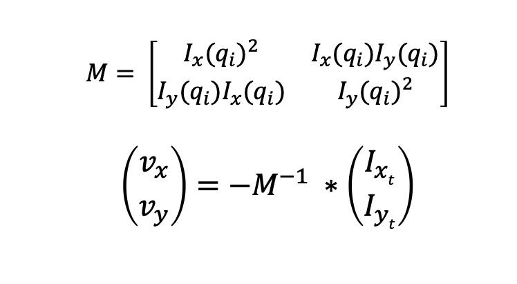
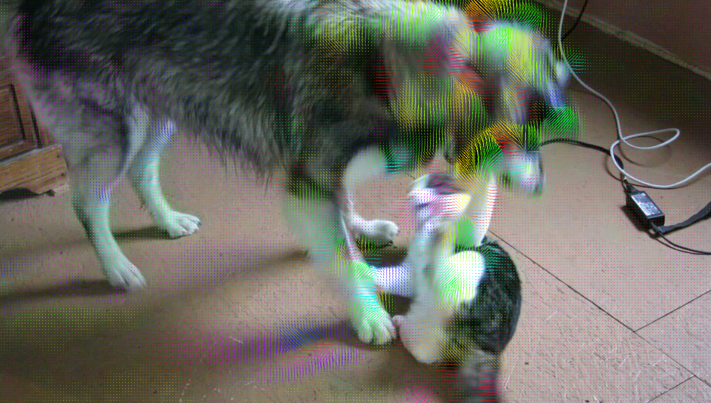

# CSE 455 Homework 4 #

Welcome, it's time for optical flow! Do the same:

```
git pull
make clean
make
```

Then `./main test hw4` and/or `python tryhw4.py`.

The overall idea is that we’ll use Lucas-Kanade’s equation to find the optical flow. For the flow equations, we need spatial and temporal gradient information .
We'll be calculating structure matrices again, so we need to do aggregated sums over regions of the image. In the end, we’ll calculate velocity from spatial and temporal gradient information and use that to draw the motion lines.

## 1. Integral images ##

Optical flow has to run on video so it needs to be fast! We'll be calculating structure matrices again so we need to do aggregated sums over regions of the image. However, instead of smoothing with a Gaussian filter, we'll use [integral images](https://en.wikipedia.org/wiki/Summed-area_table) to simulate smoothing with a box filter.


#### TO DO ####
Fill in `image make_integral_image(image im)` as described in the wikipedia article.

Note that you must do zero-padding as your padding method in this function. Since your `get_pixel()` was using clamp-padding, you may not want to use the `get_pixel` methods unless you do bounds checking so you don't run into trouble. You can either use `.data[]` to get the pixel value, or write a new function (e.g `get_pixel_zero()`) and use zero padding there. Please avoid changing your original `get_pixel()` since we use our own solution for your previous homework and if you change that function, we might no be able to compile your homework properly.
## 2. Smoothing using integral images ##

We can use our integral image to quickly calculate the sum of regions of an image. Be careful, this is not the your old `make_box_filter()` from your other homework. It is using the integral image, and a smooth window size.

#### TO DO ####
Fill in `image box_filter_image(image im, int s)` so that every pixel in the output is the average of pixels in a given window size `s`. Note that you must call your `make_integral_image()` in this function.

## 3. Lucas-Kanade optical flow ##

We'll be implementing [Lucas-Kanade](https://en.wikipedia.org/wiki/Lucas%E2%80%93Kanade_method) optical flow. We'll use a structure matrix but this time with temporal information as well. The equation we'll use is:


### 3.1 Time-structure matrix ###

We'll need spatial and temporal gradient information for the flow equations. Calculate a time-structure matrix. Spatial gradients can be calculated as normal. The time gradient can be calculated as the difference between the previous image and the next image in a sequence.

#### TO DO ####
Fill in `image time_structure_matrix(image im, image prev, int s)`.

### 3.2 Calculating velocity from the structure matrix ###

#### TO DO ####
Fill in `image velocity_image(image S, int stride)` to use the equation to calculate the velocity of each pixel in the x and y direction. For each pixel, fill in the `matrix M`, invert it, and use it to calculate the velocity.


Try calculating the optical flow between two dog images using `tryhw4.py`:

    a = load_image("data/dog_a.jpg")
    b = load_image("data/dog_b.jpg")
    flow = optical_flow_images(b, a, 15, 8)
    draw_flow(a, flow, 8)
    save_image(a, "lines")

It may look something like:



## 4. EXTRA CREDIT: Optical flow demo using OpenCV ##

Using OpenCV we can get images from the webcam and display the results in real-time. Try installing OpenCV and enabling OpenCV compilation in the Makefile (set `OPENCV=1` in the first line). Then run:

    optical_flow_webcam(15,4,8)

## Turn it in ##

Turn in your `flow_image.c` on canvas under Homework 4. If you did the extra credit part, submit a screenshot of your result on webcam (in .jpg or .png format).
