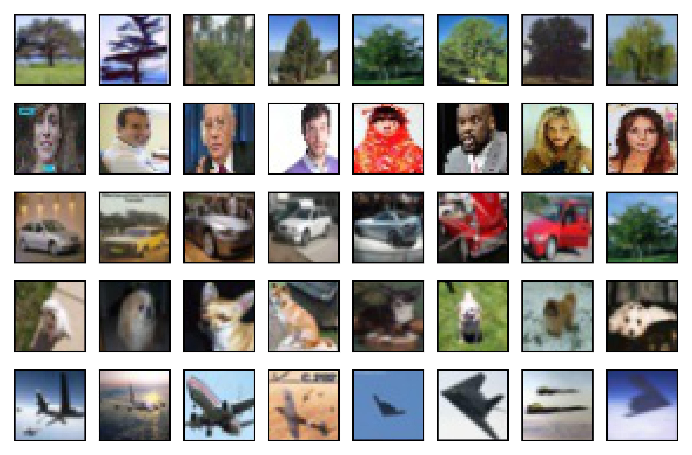

# CSE 455 Homework 6

Due Thursday, June 04 at 11:59 pm

Welcome, it's time for neural networks! Needless to say, run

```
git pull
make clean
make
```

Then, under the `src/hw6` folder, run the following command to unzip the dataset:
```
unzip small_data.zip
```

We only need Python for this homework, and you can ignore all the C files and the Makefile.

In this homework, we will implement a deep convolutional neural network (CNN) for image classification. 
We will use a customized dataset with 5 classes (i.e. face, airplane, dog, car, tree), and the dataset contains a thousand 30x30 color images per class. 
This dataset is selected from AffectNet, ImageNet, and CIFAR-10.  This "toy" dataset is small enough to run on a CPU so that you can taste deep learning with limited resources.




Turn in your answers (in a _report.pdf_ file) and code (the _answer.py_ file) for your submission.
We strongly advise you to review lecture notes and PyTorch
[tutorial](https://pytorch.org/tutorials/beginner/deep_learning_60min_blitz.html)
before starting this homework.

For grading purpose, do not change anything in other files in the starter code, and train your model for 10 epochs for each question. The training and evaluation code are already finished for you in the _main.py_ and _helper.py_ files. 
The _train.csv_ and _valid.csv_ files define the location and label for each image, which are then loaded into deep learning models by the _loader.py_ code.

Read the _run_ function in _helper.py_ to understand the logic of training process.

Your code will be tested in Python 3.7 and PyTorch 1.5 under the Linux environment, where the installation steps can be found in the appendix. You should not import any other libraries in your code.


## Submission ##
Submit your assignment to [Canvas](https://canvas.uw.edu/courses/1371994/assignments/5332140).
Your _report.pdf_ and _answer.py_ files should be be submitted.


For each question, you need to report your results in three aspects:

- How many trainable parameters are in the model? It is printed in the terminal.
- What is the best training accuracy?
- What is the best validation accuracy? Is it better than the ones in previous questions?
- According to the training and validation accuracies, does the model overfit your training data?


## 1. Neural Network ##

We have created a simple neural network with one hidden layer (_NN_ class in the _answer.py_ file).
Train the model by using the command `python main.py --model NN`.

Make sure you understand the _NN_ class in the _answer.py_ file before answering other questions.


## 2. Simple Convolution Neural Network ##

We have created a simple convolutional neural network with one hidden convolutional layer and one hidden fully-connected layer (_SimpleCNN_ class in the _answer.py_ file). 
Finish the _forward_ function and train the model with the command  `python main.py --model SimpleCNN`.
Remember to add the ReLU activation into your _forward_ function.


## 3. Color Normalization ##

One way to resolve various lightning conditions in input images is to normalize the color of images. 
For simplicity, let us use 0.5 as the mean and 0.5 as the standard deviation for each color channel.
Implement the _norm transformer_ variable in the _answer.py_ file, and run 
`python main.py --model SimpleCNN --transform norm`.


## 4. Deep Convolutional Neural Network ##

CNNs with only one convolutional layer can only extract simple features from images, but deeper CNNs can extract more complex information. In this question, you need to complete the _DeepCNN_ class in the _answer.py_ file. 

As shown in the following table, when given an array (e.g. [8, 16, 32, "pool"]), the DeepCNN should create a deep network  with corresponding convolutional layers (i.e. 8-channel convLayer, 16-channel convLayer, 32-channel convLayer, max pooling layer), and then add a fully-connected layer after the last convolutional (or pooling) layer.

<table style="border-collapse:collapse;border-spacing:0;border-color:#999" class="tg"><tr><th style="font-family:Arial, sans-serif;font-size:14px;font-weight:normal;padding:10px 5px;border-style:solid;border-width:1px;overflow:hidden;word-break:normal;border-color:inherit;color:#fff;background-color:#26ADE4;text-align:left">Layer</th><th style="font-family:Arial, sans-serif;font-size:14px;font-weight:normal;padding:10px 5px;border-style:solid;border-width:1px;overflow:hidden;word-break:normal;border-color:inherit;color:#fff;background-color:#26ADE4;text-align:center">Output Size</th><th style="font-family:Arial, sans-serif;font-size:14px;font-weight:normal;padding:10px 5px;border-style:solid;border-width:1px;overflow:hidden;word-break:normal;border-color:inherit;color:#fff;background-color:#26ADE4;text-align:center">Output Channels</th></tr><tr><td style="font-family:Arial, sans-serif;font-size:14px;padding:10px 5px;border-style:solid;border-width:1px;overflow:hidden;word-break:normal;border-color:inherit;color:#444;background-color:#F7FDFA;text-align:left">Input</td><td style="font-family:Arial, sans-serif;font-size:14px;padding:10px 5px;border-style:solid;border-width:1px;overflow:hidden;word-break:normal;border-color:inherit;color:#444;background-color:#F7FDFA;text-align:center">30 x 30</td><td style="font-family:Arial, sans-serif;font-size:14px;padding:10px 5px;border-style:solid;border-width:1px;overflow:hidden;word-break:normal;border-color:inherit;color:#444;background-color:#F7FDFA;text-align:center">3</td></tr><tr><td style="font-family:Arial, sans-serif;font-size:14px;padding:10px 5px;border-style:solid;border-width:1px;overflow:hidden;word-break:normal;border-color:inherit;color:#444;background-color:#F7FDFA;text-align:left">Conv</td><td style="font-family:Arial, sans-serif;font-size:14px;padding:10px 5px;border-style:solid;border-width:1px;overflow:hidden;word-break:normal;border-color:inherit;color:#444;background-color:#F7FDFA;text-align:center">28 x 28</td><td style="font-family:Arial, sans-serif;font-size:14px;padding:10px 5px;border-style:solid;border-width:1px;overflow:hidden;word-break:normal;border-color:inherit;color:#444;background-color:#F7FDFA;text-align:center">8</td></tr><tr><td style="font-family:Arial, sans-serif;font-size:14px;padding:10px 5px;border-style:solid;border-width:1px;overflow:hidden;word-break:normal;border-color:#999;color:#444;background-color:#F7FDFA;text-align:left;vertical-align:top">ReLU</td><td style="font-family:Arial, sans-serif;font-size:14px;padding:10px 5px;border-style:solid;border-width:1px;overflow:hidden;word-break:normal;border-color:#999;color:#444;background-color:#F7FDFA;text-align:center;vertical-align:top">28 x 28</td><td style="font-family:Arial, sans-serif;font-size:14px;padding:10px 5px;border-style:solid;border-width:1px;overflow:hidden;word-break:normal;border-color:#999;color:#444;background-color:#F7FDFA;text-align:center;vertical-align:top">8</td></tr><tr><td style="font-family:Arial, sans-serif;font-size:14px;padding:10px 5px;border-style:solid;border-width:1px;overflow:hidden;word-break:normal;border-color:#999;color:#444;background-color:#F7FDFA;text-align:left;vertical-align:top">Conv</td><td style="font-family:Arial, sans-serif;font-size:14px;padding:10px 5px;border-style:solid;border-width:1px;overflow:hidden;word-break:normal;border-color:#999;color:#444;background-color:#F7FDFA;text-align:center;vertical-align:top">26 x 26 </td><td style="font-family:Arial, sans-serif;font-size:14px;padding:10px 5px;border-style:solid;border-width:1px;overflow:hidden;word-break:normal;border-color:#999;color:#444;background-color:#F7FDFA;text-align:center;vertical-align:top">16</td></tr><tr><td style="font-family:Arial, sans-serif;font-size:14px;padding:10px 5px;border-style:solid;border-width:1px;overflow:hidden;word-break:normal;border-color:#999;color:#444;background-color:#F7FDFA;text-align:left;vertical-align:top">ReLU</td><td style="font-family:Arial, sans-serif;font-size:14px;padding:10px 5px;border-style:solid;border-width:1px;overflow:hidden;word-break:normal;border-color:#999;color:#444;background-color:#F7FDFA;text-align:center;vertical-align:top">26 x 26</td><td style="font-family:Arial, sans-serif;font-size:14px;padding:10px 5px;border-style:solid;border-width:1px;overflow:hidden;word-break:normal;border-color:#999;color:#444;background-color:#F7FDFA;text-align:center;vertical-align:top">16</td></tr><tr><td style="font-family:Arial, sans-serif;font-size:14px;padding:10px 5px;border-style:solid;border-width:1px;overflow:hidden;word-break:normal;border-color:#999;color:#444;background-color:#F7FDFA;text-align:left;vertical-align:top">Conv</td><td style="font-family:Arial, sans-serif;font-size:14px;padding:10px 5px;border-style:solid;border-width:1px;overflow:hidden;word-break:normal;border-color:#999;color:#444;background-color:#F7FDFA;text-align:center;vertical-align:top">24 x 24</td><td style="font-family:Arial, sans-serif;font-size:14px;padding:10px 5px;border-style:solid;border-width:1px;overflow:hidden;word-break:normal;border-color:#999;color:#444;background-color:#F7FDFA;text-align:center;vertical-align:top">32</td></tr><tr><td style="font-family:Arial, sans-serif;font-size:14px;padding:10px 5px;border-style:solid;border-width:1px;overflow:hidden;word-break:normal;border-color:#999;color:#444;background-color:#F7FDFA;text-align:left;vertical-align:top">ReLU</td><td style="font-family:Arial, sans-serif;font-size:14px;padding:10px 5px;border-style:solid;border-width:1px;overflow:hidden;word-break:normal;border-color:#999;color:#444;background-color:#F7FDFA;text-align:center;vertical-align:top">24 x 24</td><td style="font-family:Arial, sans-serif;font-size:14px;padding:10px 5px;border-style:solid;border-width:1px;overflow:hidden;word-break:normal;border-color:#999;color:#444;background-color:#F7FDFA;text-align:center;vertical-align:top">32</td></tr><tr><td style="font-family:Arial, sans-serif;font-size:14px;padding:10px 5px;border-style:solid;border-width:1px;overflow:hidden;word-break:normal;border-color:#999;color:#444;background-color:#F7FDFA;text-align:left;vertical-align:top">Max Pool</td><td style="font-family:Arial, sans-serif;font-size:14px;padding:10px 5px;border-style:solid;border-width:1px;overflow:hidden;word-break:normal;border-color:#999;color:#444;background-color:#F7FDFA;text-align:center;vertical-align:top">12 x 12</td><td style="font-family:Arial, sans-serif;font-size:14px;padding:10px 5px;border-style:solid;border-width:1px;overflow:hidden;word-break:normal;border-color:#999;color:#444;background-color:#F7FDFA;text-align:center;vertical-align:top">32</td></tr><tr><td style="font-family:Arial, sans-serif;font-size:14px;padding:10px 5px;border-style:solid;border-width:1px;overflow:hidden;word-break:normal;border-color:#999;color:#444;background-color:#F7FDFA;text-align:left;vertical-align:top">Linear</td><td style="font-family:Arial, sans-serif;font-size:14px;padding:10px 5px;border-style:solid;border-width:1px;overflow:hidden;word-break:normal;border-color:#999;color:#444;background-color:#F7FDFA;text-align:center;vertical-align:top" colspan="2">5</td></tr></table>


You can assume the input data for this model is always a $3 \times 30 \times 30$ PyTorch Tensor (which is a $30 \times 30$ RGB image). 
We will always use 2D convolutional layers with kernel size 3, stride 1, padding 0, dilation 1, and group 1; you should add a ReLU activation function after every convolutional layer. Similarly, we will always use max-pooling layers with kernel size 2, padding 0, and dilation 1.
You can use _nn.Sequential_ to make your code cleaner.

You need to reshape tensors to $(b \times p)$ size before feeding them to the first fully-connected layer, where $b$ is the batch size and $p$ is the length of feature vector. Make sure you calculated the tensor size correctly. 

With a 3 hidden-layer CNN (i.e. [8, 16, 32, "pool"]), run `python main.py -m DeepCNN --layers 8 16 32 pool --transform norm`.


## 5. Data Augmentation ##

Now, we want to perform the random affine transformation and random horizontal flip to train images. Use the _torchvision.transforms_ package to finish the variable _aug transformer_.
In order to make the result comparible to previous questions, you should include color normalization (as implemented in question 3) after data augmentation.
The answer to this question is extremely short (less than 5 lines).
Run `python main.py --model DeepCNN --layers 8 16 32 pool --transform aug`.


## Appendix ##
You can use the following steps to setup Python and PyTorch environment for this assignment:

* Install Python 3.6. If you use conda to manage Python environments, you can use the command: `conda create -n py37 python=3.7`.
* (Optional) Install CUDA if there is a Nvidia GPU in your computer. [Download Link](https://developer.nvidia.com/cuda-downloads).
* Install PyTorch from its official [website](https://pytorch.org/).
* Install pandas, numpy, tqdm, Pillow, torchvision, and argparse packages using the command: `pip install pandas  numpy  tqdm  Pillow  torchvision  argparse`.


